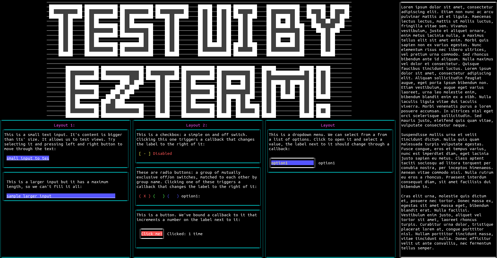

# EzTerm

A YAML(ish) based terminal GUI framework for- and by Rust, focussed on making it quick and easy to create a
functional UI for an app or game. Based on Crossterm and inspired by Kivy.

The vision is an easy-to-use terminal UI framework that can be used by anyone almost immediately. Deciding you
want your app to have a UI only to find out that writing the UI will take at least as much study as your original
idea is what I'm trying to prevent.
You should be able to write most of the UI through config files using high-level layouts that do the work for you 
(e.g. box layouts, table layouts, stacking layouts, etc.). Code should only be necessary where it makes sense
(writing callbacks for example). This way you can focus on coding an App, not a UI. Widgets should (at least 
initially) be elementary: buttons, labels, checkboxes, etc. Combining simple widgets with smart layouts can still
yield impressive UIs, while still maintaining a simple API that doesn't require much study.

Dividing the screen in four labels, should be as simple as:

```
- layout: my_horizontal_box
    mode: box
    orientation: horizontal
    - layout: my_vertical_box_left
        mode: box
        orientation: vertical
        - label: my_upper_left_label
            text: "hello"
        - label: my_lower_left_label
            text: "hello"
    - layout: my_vertical_box_right
        mode: box
        orientation: vertical
        - label: my_upper_right_label
            text: "hello"
        - label: my_lower_right_label
            text: "hello"
```

If this seems useful to you please let me know; if there's interest I will
spend more time building out the framework.

# Current state
Very much a work in progress and still not available on Cargo.
See Roadmap.md for what I'm working on. First priority is automatic sizing using size hints.

Currently supports the following:

- Widgets:
  - Box layouts (automatically place widgets next to each other or below each
    other)
  - Float layouts (hard coded widget positions)
  - Label (text displaying widget)
  - Text input (input and display text)
  - Checkbox (simple on/off switch)
  - Radio buttons (mutually exclusive groups of switches)
  - Dropdowns (list of values from which one can be chosen)
  - Canvases (load content from text file or can be painted manually)
  - Colors and borders for widgets.
- Callbacks:
  - On keyboard enter
  - On left/right click
  - On value chang
  

   
  