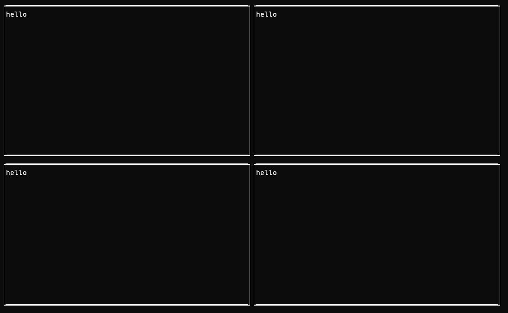
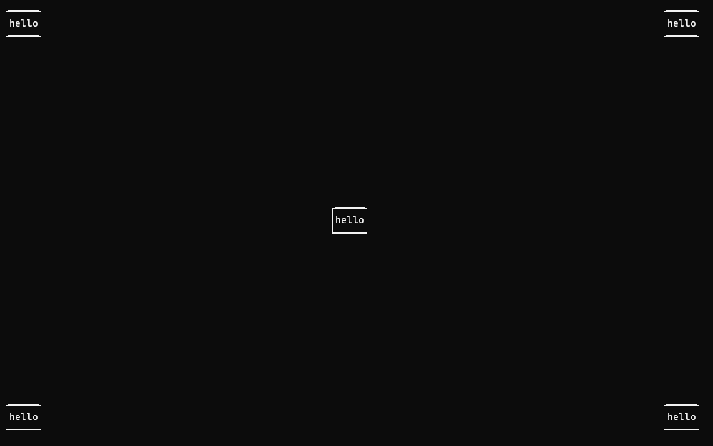

# EzTerm

A YAML(ish) based terminal GUI framework for- and by Rust, focussed on making it quick and easy to create a
functional UI for an app or game. Based on Crossterm and inspired by Kivy.


# Introduction
The vision is an easy-to-use terminal UI framework that can be used by anyone almost immediately without much study.
You should be able to write most of the UI through config files using high-level layouts that do the work for you 
(e.g. box layouts, table layouts, stacking layouts, etc.). Sizing and positioning should be possible through size hints
and positions hints, unless you specifically want to hard code size/position.

Code should only be necessary where it makes sense (writing callbacks for example). This way you can focus on coding
your app, not a UI. Widgets should (at least initially) be elementary: buttons, labels, checkboxes, etc. Combining 
simple widgets with smart layouts can still yield impressive UIs, while still maintaining a simple API that doesn't
require much study.

Dividing the screen in four text labels, should be as simple as:
```

- Layout: my_horizontal_box
    mode: box
    orientation: horizontal
    - Layout: my_vertical_box_left
        mode: box
        orientation: vertical
        - Label: my_upper_left_label
            text: hello
        - Label: my_lower_left_label
            text: hello
    - Layout: my_vertical_box_right
        mode: box
        orientation: vertical
        - Label: my_upper_right_label
            text: hello
        - Label: my_lower_right_label
            text: hello
```


Positioning those labels to be on the outer edges of the screen increases complexity, 
but if the framework is doing its job not by much. We could use a float layout to have more control over position,
auto size the labels to be as large as their text content (so they don't fill the entire layout) and then use 
position hints to place them. We'll also create a new label in the middle of the screen, to show off position hints
a bit more. To top it off, we'll introduce a template to define our label style, so we don't have to copy paste it
over and over.

```
- <MyLabelTemplate@Label>:
    text: hello
    border: True
    auto_scale: true, true

- Layout:
    id: my_float_layout
    mode: float
    - MyLabelTemplate:
        id: my_upper_left_label
        pos_hint: left, top
    - MyLabelTemplate:
        id: my_middle_label
        pos_hint: center, middle
    - MyLabelTemplate:
        id: my_lower_left_label
        pos_hint: left, bottom
    - MyLabelTemplate:
        id: my_upper_right_label
        pos_hint: right, top
    - MyLabelTemplate:
        id: my_lower_right_label
        pos_hint: right, bottom

```


Combining simple concepts such as size hints, position hints, horizontal/vertical alignment, padding, etc. should
allow you to make relatively complex layouts without painstakingly hardcoding sizes, or writing your own scaling
formulas.

Widget properties can be bound to the properties of other widgets of the same type
(syncing them automatically), or to custom properties you create and can pass to your app. First an
example of binding the height of one widget to another:
```
- Layout:
  id: parent_layout
  - Label:
    id: label_1
    height: 5
  - Label:  
    id: label_2
    height: parent.label_1.height
```

Sometimes you want to bind the property of a widget to a value in your app. For example, binding the
progress of your app to a progress bar. To make this simpler, you can register a custom property, bind
it to a widget property, and then update the property in your app (which automatically syncs it to the 
UI). Here is an example:

```
// First we load the config file
let (root_widget, mut scheduler) = ez_term::load_ez_ui("./Examples/full_example.ez");

// Before we start the UI we register a custom property
let value_property = scheduler.new_usize_property("progress_property".to_string(), 0);

// Now, in the config file, we bind the progress bar property to our custom property
- ProgressBar:
    id: progress_bar
    value: properties.progress_property
    max: 100
    
// The following function represents our example app:
fn progress_example_app(mut properties: HashMap<String, ez_term::EzProperties>) {

    let value_property = properties.get_mut("progress_property").unwrap();
    for x in 1..6 {
        value_property.as_usize_mut().set(x*20);
        std::thread::sleep(Duration::from_secs(1))
    };
}

// Now we bind a callback to a button that starts our example app when clicked:
let start_app = 
    |context: EzContext| {
        context.scheduler.schedule_threaded(Box::new(progress_example_app), None)
    }
scheduler.update_callback_config("progress_button",
    ez_term::CallbackConfig::from_on_press(
        Box::new(start_app)));
```

If this seems useful to you please let me know or star the repo, so I can gauge interest.

# Current state
Very much a work in progress and still not available on Cargo. See the projects page for what I'm working on. 

Currently supports the following:

- Ez language:
  - Define entire UI in an Ez file using simple english
  - Supports templates and template inheritance
  - Bind widget parameters to one another (e.g. 'width: another_widget.width')
  - Refer to other widgets' values from within the config file
- Widgets:
  - Screen layout (multiple screens, one active at a time)
  - Tabbed layout
  - Box layout (automatically place widgets next to each other or below each
    other)
  - Float layout (use size hints and position hints, or hard code positions/sizes)
  - Label 
  - Text input
  - Checkbox 
  - Slider
  - Progress bar
  - Radio buttons
  - Dropdowns 
  - Canvases (load content from text file or fill manually through code)
  - Popups (widget templates that pop up on callback)
- Widget features:
  - Size hints
  - Position hints
  - Padding
  - Vertical/horizontal alignment
  - Auto scaling for most widgets (adjust widget size to actual content minimizing size)
  - Colors and borders.
  - Resize if terminal resizes
- Callbacks:
  - On keyboard enter
  - On left/right click
  - On value change
  - On press (both keyboard enter and left mouse click)
  