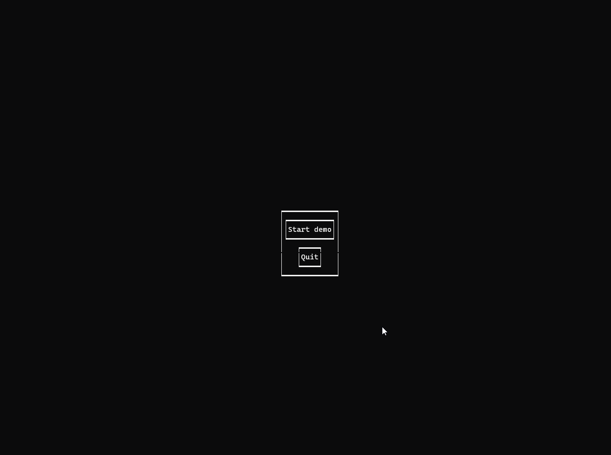



# EzTerm

A YAML(ish) based terminal GUI framework for- and by Rust, focussed on making it quick and easy to create a
functional UI for an app or game. Based on Crossterm and inspired by Kivy.

## Introduction
EzTerm is an easy-to-use cross-platform terminal UI framework that allows you to create your UI through YAML-ish config files.
This allows you to focus on coding your App, instead of the UI. Using smart layout modes, size hints and position hints,
you can create any kind of UI without worrying about the specifics of sizes, positions or scaling.

Code is only necessary when it's truly necessary, for example when writing callbacks.
Widgets are (for now) elementary: buttons, labels, checkboxes, etc. Combining 
simple widgets with smart layouts can still yield impressive UIs, while still maintaining a simple API that doesn't
require much study.

## Features
- Smart layout modes (Box, Table, Stack and Float)
- Tabbed layouts
- Multiple screens
- ALl basic widgets (labels, text inputs, buttons, checkboxes, radio buttons, dropdowns, sliders, canvases)
- Full callback support
- Binding any keyboard keys to widgets or globally
- Scheduled tasks
- Threaded background tasks to run blocking code (i.e. your app)
- Binding widget properties to each other from config (including maths)
- Creating- and destroying widgets programmatically

## Tutorial

A full tutorial is available at the [Wiki](https://github.com/ddbnl/ez_term/wiki/Tutorial-start)

## Examples

Examples available at the [Wiki](https://github.com/ddbnl/ez_term/wiki/Examples)

## API reference

A full API reference is available at the [Wiki](https://github.com/ddbnl/ez_term/wiki/Reference)
