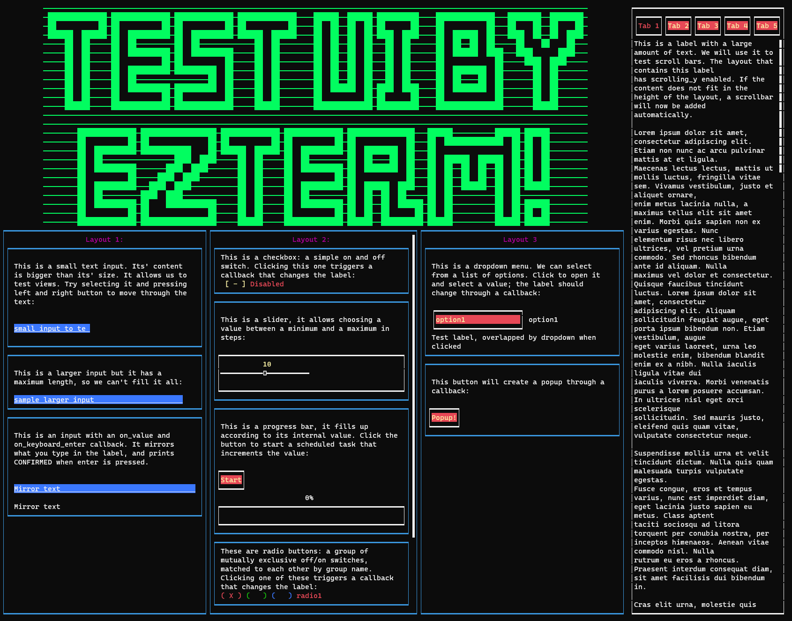

# EzTerm

A YAML(ish) based terminal GUI framework for- and by Rust, focussed on
making it quick and easy to create a functional UI for an app or game.
Based on Crossterm.

The vision is being able to write most of the UI from config files
without hardcoding sizes and XY positions (unless you really want to),
and only using code where it makes sense (writing callbacks for example). 
The config files are inspired by Kivy.

If this seems useful to you please let me know; if there's interest I will
spend more time building out the framework.

# Current state
Very much a work in progress and still not available on Cargo.
See Roadmap.md for what I'm working on. Currently supports the following:

- Widgets:
  - Box layouts (automatically place widgets next to each other or below each
    other)
  - Float layouts (hard coded widget positions)
  - Label (text displaying widget)
  - Text input (input and display text)
  - Checkbox (simple on/off switch)
  - Radio buttons (mutually exclusive groups of switches)
  - Dropdowns (list of valus from which one can be chosen)
  - Colors and borders for widgets.
- Callbacks:
  - On keyboard enter
  - On left/right click
  - On value chang
  

   
  